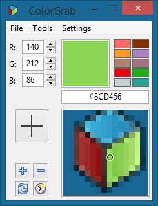
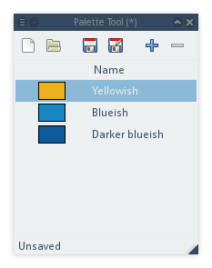
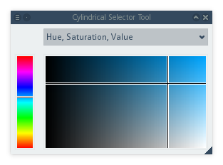

# ColorGrab
A cross-platform color picker.

## License
Copyright (C) 2015 Niels Sonnich Poulsen (http://nielssp.dk)

Permission is hereby granted, free of charge, to any person obtaining a copy
of this software and associated documentation files (the "Software"), to deal
in the Software without restriction, including without limitation the rights
to use, copy, modify, merge, publish, distribute, sublicense, and/or sell
copies of the Software, and to permit persons to whom the Software is
furnished to do so, subject to the following conditions:

The above copyright notice and this permission notice shall be included in all
copies or substantial portions of the Software.

THE SOFTWARE IS PROVIDED "AS IS", WITHOUT WARRANTY OF ANY KIND, EXPRESS OR
IMPLIED, INCLUDING BUT NOT LIMITED TO THE WARRANTIES OF MERCHANTABILITY,
FITNESS FOR A PARTICULAR PURPOSE AND NONINFRINGEMENT. IN NO EVENT SHALL THE
AUTHORS OR COPYRIGHT HOLDERS BE LIABLE FOR ANY CLAIM, DAMAGES OR OTHER
LIABILITY, WHETHER IN AN ACTION OF CONTRACT, TORT OR OTHERWISE, ARISING FROM,
OUT OF OR IN CONNECTION WITH THE SOFTWARE OR THE USE OR OTHER DEALINGS IN THE
SOFTWARE.

## Features

  * Pick colors from screen.
  * Magnify screen.
  * Convert between color models and representations.
  * Palette tool.

## Install

### Linux
An Arch Linux package is available on the [AUR](https://aur.archlinux.org/packages/colorgrab/).

To compile ColorGrab on Linux, make sure that you have wxgtk 3.0 or newer, as well as cmake and a C++ compiler. Then run:

    git clone https://github.com/Acolarh/colorgrab
    cd colorgrab
    cmake .
    make

### Windows
A Windows-installer (as well as a standalone executable) is available under [releases](https://github.com/Acolarh/colorgrab/releases).

To compile ColorGrab on Windows you can use [MinGW](http://www.mingw.org). If you use MinGW you will have to manually add GDI+ headers (see [this blog post](http://www.miscdebris.net/blog/2009/09/17/adding-gdi-headers-to-mingw-to-compile-wxwidgets-with-wxgraphicscontext-support/)) before compiling [wxWidgets](http://wxwidgets.org/).

More information about compiling wxWidgets on Windows is available on the [wxWidgets wiki](https://wiki.wxwidgets.org/Main_Page).
